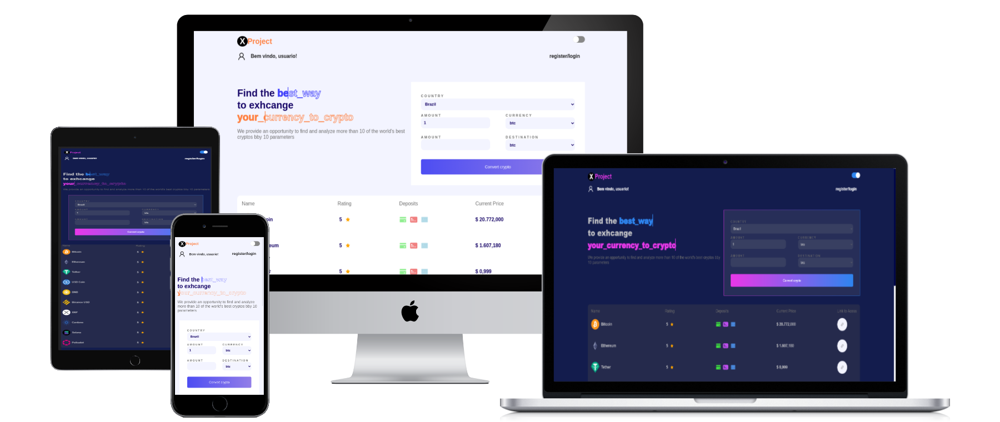

[](https://opensource.org/licenses/MIT)
[](https://github.com/renanlido/ignews/commits)
[](https://nextjs.org/)
[](https://pt-br.reactjs.org/)
[](https://www.typescriptlang.org/)

<!--LOGO-->
<br/>
<div align="center">
    <h1 color="#ffff" >Initial project config with Next Js, Typescript, ESlint, Prettier and Styled-Components</h1>
    </br>
</div>

<!-- ABOUT THE PROJECT -->


This is a [Next.js](https://nextjs.org/) project bootstrapped with [`create-next-app`](https://github.com/vercel/next.js/tree/canary/packages/create-next-app).

## X Project


```bash

Site de monitoramento de preços de criptoativos

```

Você pode acessar o site aqui: [`X-Project`](https://x-project-kappa.vercel.app). 


X Project é o melhor lugar para você encontra as  melhores crypto moedas do mercado, de forma rapida e muito simples.


Entre em contato comigo: [`Linkedin`](https://www.linkedin.com/in/luan-ferreira-6b4a25181/) | [`Discord`](https://discordapp.com/users/337584872262729730) | [`Whatsapp`](https://api.whatsapp.com/send?phone=5577981451593&text=Oie%2C%20vamos%20trocar%20uma%20ideia!) | [`Email`](https://is.gd/ltuM33) 



